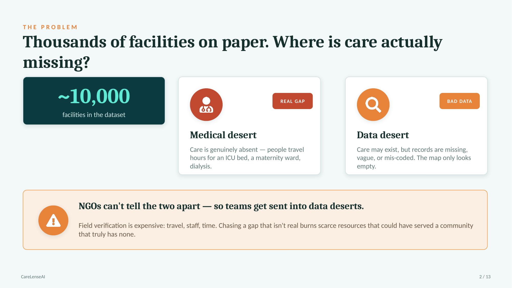
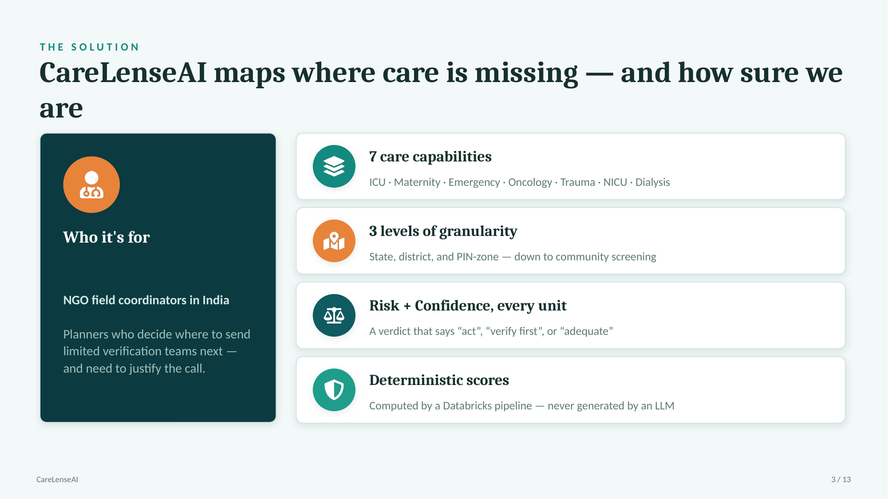
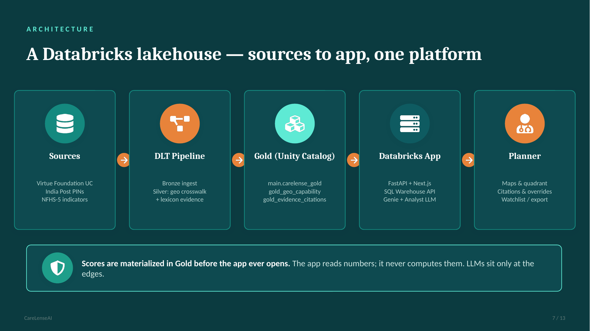

# CareLenseAI — Medical Desert Planner

**Track 2: Medical Desert Planner** for the [Databricks Apps & Agents for Good Hackathon 2026](https://developers.databricks.com/hackathon).

> Where are the highest-risk gaps in care, and how confident are we that those gaps are real?

CareLenseAI helps NGO coordinators and healthcare planners in India distinguish **real care deserts** from **data-poor regions** using trust-weighted evidence from 10,000 messy facility records.

---

## Overview

Most maps can't tell the difference between a place where **care is genuinely missing** and a place where **the data is just bad** — both look like empty spots. CareLenseAI scores every region on two separate axes (**risk** = how bad the gap looks, **confidence** = how much we trust that picture), so planners spend limited field visits where it actually counts.

### The problem



### The solution



### Architecture



> **Trust boundary:** scores are materialized in Gold *before* the app opens — the app reads numbers, it never computes them. LLMs (Genie for natural-language Q&A, and the verification-plan agent) sit only at the edges and never generate a score.

---

## Demo workflow (3-minute pitch)

1. **Select a capability** (e.g., Emergency, ICU, Maternity) and geography level (state / city / PIN).
2. **View the coverage map** — color-coded by trust-weighted coverage, sized by facility count.
3. **Review the regional table** — gap risk vs. data confidence for each region.
4. **Drill into a region** — see facility-level trust signals with **cited excerpts** from source text.
5. **Save a planning scenario** with notes for follow-up field verification.

## Architecture (detail)

```
┌─────────────────────────────────────────────────────────────┐
│              Databricks App (FastAPI + Next.js)              │
│  Next.js static UI  ←→  FastAPI /api  ←→  SQL warehouse      │
│  Genie (/api/ask, NL Q&A)  │  Verification-plan agent        │
├─────────────────────────────────────────────────────────────┤
│  DLT Pipeline (bronze/silver)  →  Gold materialization job   │
├─────────────────────────────────────────────────────────────┤
│  Unity Catalog (main.carelense_gold)  │  Lakebase (scenarios)│
└─────────────────────────────────────────────────────────────┘
```

The `genie/` and `agent/` folders hold the LLM-at-the-edges layer: Genie answers natural-language questions over the Gold tables, and the agent drafts field-verification plans grounded in facility `rec_id`s. Neither ever produces a risk or confidence score — those come only from the deterministic pipeline.

## Trust scoring

For each facility + capability, we scan `capability`, `procedure`, `equipment`, `specialties`, and `description` fields:

| Signal                | Meaning                                                |
| --------------------- | ------------------------------------------------------ |
| **Strong evidence**   | Corroborated across multiple structured fields         |
| **Partial evidence**  | Mentioned in one structured field or clear description |
| **Weak / suspicious** | Vague mention only, or sparse record                   |
| **No claim**          | No textual evidence found                              |

Gap risk combines **trust-weighted coverage** with **data richness** so planners don't confuse missing data with missing care.

## Local development

```
# Backend
python -m venv .venv
.venv\Scripts\activate        # Windows
# source .venv/bin/activate   # macOS/Linux
pip install -r requirements.txt

# Frontend (optional — pre-built export in app/frontend/out)
cd app/frontend && npm install && npm run build && cd ../..

# Run FastAPI (serves /api and static Next export)
set GOLD_CATALOG=main
uvicorn app.backend.main:app --reload --port 8000
```

Open <http://localhost:8000> for the UI and <http://localhost:8000/api/health> for the API.

## Deploy to Databricks (demo)

**Single entry point:** `scripts/deploy_infrastructure.py`

Gold tables must live in catalog **`main`** (`GOLD_CATALOG=main` in `app.yaml` and pipeline config).

### 1. Prerequisites

```
databricks auth login --host https://YOUR-WORKSPACE.cloud.databricks.com

export DATABRICKS_HOST=https://YOUR-WORKSPACE.cloud.databricks.com
export DATABRICKS_TOKEN=your-personal-access-token
export DATABRICKS_WAREHOUSE_ID=your-warehouse-id
export GOLD_CATALOG=main
```

Add the hackathon dataset from Marketplace and confirm `FACILITY_CATALOG`, `FACILITY_SCHEMA`, and `FACILITY_TABLE` in `app.yaml` match your workspace.

Build the frontend export before deploy (included in repo as `app/frontend/out`):

```
cd app/frontend && npm install && npm run build
```

### 2. Full deploy

```
python scripts/deploy_infrastructure.py
```

This uploads source, creates UC schemas, runs the DLT pipeline (bronze/silver), triggers the **Gold Materialization** job (`notebooks/jobs/01_materialize_gold.py`), grants permissions, and redeploys the Databricks App.

### 3. Materialize gold only (re-run after pipeline)

On the workspace, run the notebook:

`notebooks/jobs/01_materialize_gold.py`

Or locally:

```
export GOLD_CATALOG=main
python scripts/materialize_gold.py
```

Writes to `main.carelense_gold.gold_geo_capability` and `main.carelense_gold.gold_evidence_citations`.

### 4. App URL

After deploy, the script prints the app URL. You can also check:

```
databricks apps get carelenseai
```

Open the URL in your browser — the FastAPI app serves the Next.js UI and `/api/*` endpoints.

### 5. Environment variables (`app.yaml`)

| Variable                  | Description                                                  |
| ------------------------- | ------------------------------------------------------------ |
| `GOLD_CATALOG`            | Unity Catalog for gold/silver schemas (**`main`**)           |
| `GOLD_SCHEMA`             | Gold schema name (`carelense_gold`)                          |
| `DATABRICKS_WAREHOUSE_ID` | SQL warehouse (auto-injected via `valueFrom: sql-warehouse`) |
| `FACILITY_CATALOG`        | Source facility dataset catalog                              |
| `FACILITY_SCHEMA`         | Source facility schema                                       |
| `FACILITY_TABLE`          | Source facility table                                        |
| `FRONTEND_DIR`            | Static Next export path (`app/frontend/out`)                 |
| `GENIE_SPACE_ID`          | Genie space for `/api/ask` (optional)                        |

## Project structure

```
CareLenseAI/
├── app.yaml                # Databricks App runtime (uvicorn FastAPI)
├── app/
│   ├── backend/            # FastAPI API + static file serving
│   └── frontend/           # Next.js UI (out/ = static export)
├── agent/                  # Verification-plan agent (cites rec_id, never scores)
├── genie/                  # Genie NL Q&A over Gold tables
├── pipeline/               # DLT bronze/silver + gold compute
├── notebooks/jobs/         # Gold materialization, grants, readiness
├── scripts/
│   └── deploy_infrastructure.py   # ← demo deploy entry point
├── lakebase/               # Scenario persistence helpers
├── docs/slides/            # Pitch slides (problem / solution / architecture)
└── requirements.txt
```

## Judging alignment

| Criterion                  | How we address it                                                   |
| -------------------------- | ------------------------------------------------------------------- |
| **Product judgment**       | Clear planner workflow: filter → map → drill → save                 |
| **Evidence & uncertainty** | Every score cites source text; gap vs. data-poor flagged separately |
| **Technical execution**    | Databricks App + DLT + Gold jobs + SQL warehouse + Lakebase + Genie |
| **Ambition**               | Multi-capability trust engine, interactive map, scenario management |

## Team

Built for the Databricks Data + AI Summit 2026 Hackathon by:

- _<your name>_
- _<teammate>_
- _<teammate>_

<!-- Replace the placeholders above with your team's names / GitHub handles. -->

## License

MIT
